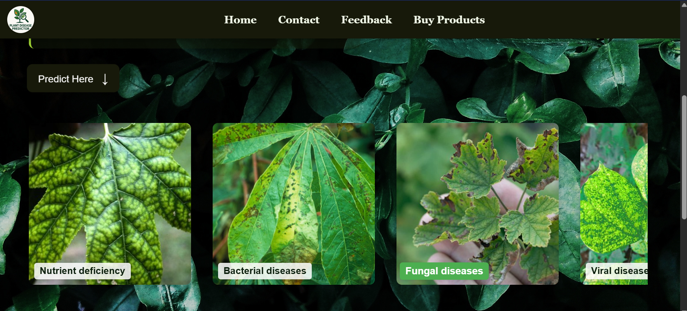
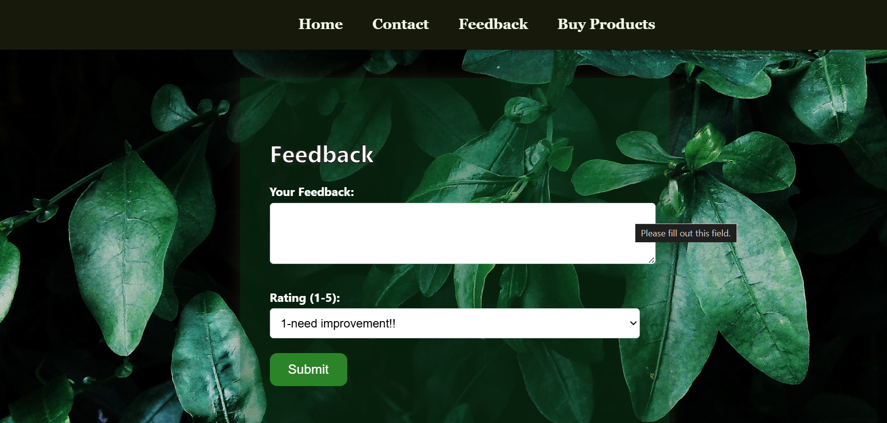

##  Project Overview

**AI PlantGuard** is an intelligent plant disease detection web application that uses a Convolutional Neural Network (CNN) to classify plant leaf images and identify diseases. Built using deep learning and deployed via a Flask web server, the system allows users to upload images through a browser and get real-time predictions.

The project is can assist farmers and agricultural researchers by automating the process of disease diagnosis, reducing dependency on manual inspection, and increasing accuracy through a trained AI model.

---

##  Key Features

-  Upload plant leaf images via an easy-to-use web interface
-  Real-time prediction using a trained deep learning CNN model
-  Trained on a Kaggle dataset with 80,000+ labeled images across 38 plant disease categories
-  Model built and evaluated in Jupyter Notebook using Keras and TensorFlow
-  Modular structure separating training, backend, and web frontend
-  Fast and lightweight Flask backend

---

##  Tech Stack

###  Languages & Frameworks
- Python 
- Flask (Web framework)
- HTML/CSS (Frontend UI)

###  Deep Learning Libraries
| Library | Purpose |
|--------|---------|
| `tensorflow` | Building and training CNN model |
| `keras` (via TensorFlow) | High-level deep learning API |
| `ImageDataGenerator` | Image preprocessing and augmentation |
| `numpy` | Numerical operations on image arrays |
| `matplotlib` | Plotting model accuracy/loss graphs |
---

##Project Structure

AI-PlantGuard/
- static/ stores images, CSS.
- templates/ holds all HTML files for rendering pages.
- app.py: Web server
- final_model_training.ipynb: AI model creation/training

----
##  Screenshots

Below are the interface screenshots of the web application:

1. **Home Page**
   - 

2. **Alternate Home Page View**
   - 

3. **Prediction Interface**
   - 

4. **Feedback Form**
   - 

5. **Contact Us Page**
   - 

